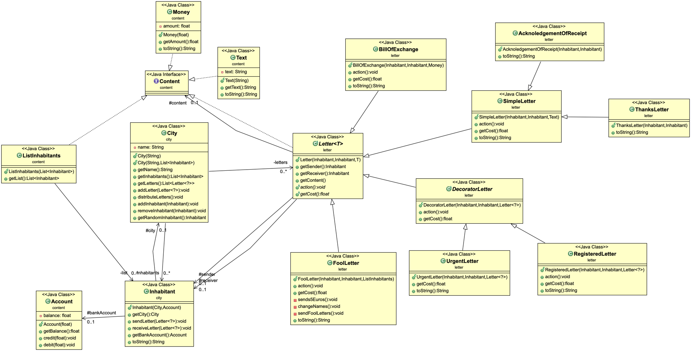

# Practical Work : Courrier
The "courrier" project is a mail simulation inside a city. There are several types of letters that city residents can send. The program takes care of sending them and managing the actions of each of the letters and all this over a cycle day by day.
### Requirements
Requirement to compile the project :

- maven

### How to
To start the simulation, make sure that you have recovered the directory of the project with this command `git clone https://gitlab-etu.fil.univ-lille1.fr/landschoot/landschoot-congin-coo.git`
Go to the "courrier" repertory `cd landschoot-congin-coo/courrier` and do the command `mvn package`. The project is now installed, there are two simulations. To execute the first simulation, do the command `java -jar target/courrier-1.0-SNAPSHOT.jar 1`. To execute the second simulation, do the command `java -jar target/courrier-1.0-SNAPSHOT.jar 2`.
To generate the javadoc, do the command `mvn javadoc:javadoc`and you will find it in the location ``target/docs``.

## Authors
* **Gabriel Congin** gabriel.congin.etu@univ-lille.fr 
* **Tony Landschoot** tony.landschoot.etu@univ-lille.fr

## Code
- Decorator : DecoratorLetter allows you to manipulate a letter that has a letter as Content.

## Docs
