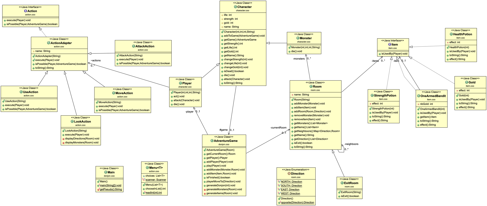

# Practical Work : Donjon
The "donjon" project is a game played directly on the bash terminal. The dungeon project is a game played directly on the bash terminal but be careful, each room is protected by powerfull monsters! ! Find items to improve your character and collect as much gold as possible! Good luck!

### Requirements
Requirement to compile the project :

- maven

### How to
To start the game, make sure that you have recovered the directory of the project with this command `git clone https://gitlab-etu.fil.univ-lille1.fr/landschoot/landschoot-congin-coo.git`
Go to the "donjon" repertory `cd landschoot-congin-coo/donjon` and do the command `mvn package`. The project is now installed, to execute it, do the command `java -jar target/donjon-1.0-SNAPSHOT.jar`.
To generate the javadoc, do the command `mvn javadoc:javadoc`and you will find it in the location ``target/docs``.

## Authors
* **Gabriel Congin** gabriel.congin.etu@univ-lille.fr 
* **Tony Landschoot** tony.landschoot.etu@univ-lille.fr

## Code
We made a method `generateDonjon(int nbRooms)` in the AdventureGame class, to generate a dungeon with the number of rooms defined in parameter with a random number of items and monsters per room.
We also made 2 design patterns :

- Adapter : ActionAdapter to convert the interface Action into a class that can be instantiated.
- Singleton : Menu, because we only need one instance of a Menu to display all the lists we need.

Finally, we did tests for the actions : We changed the inputStream of the Scanner to simulate user input.

## Docs
