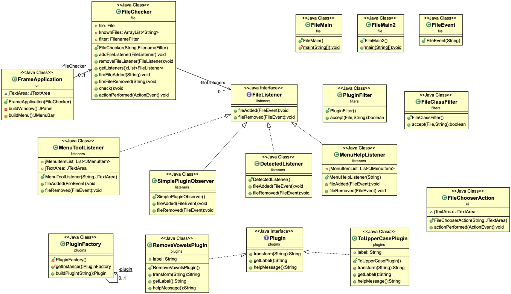

# Practical Work : Plugins
The "plugins" project is an application that adapts dynamically depending on “Plugins” installed in a directory. There are two plugins : the one to capitalize and one to remove vowels with associated help messages.
### Requirements
Requirement to compile the project :

- maven

### How to
To start the application, make sure that you have recovered the directory of the project with this command `git clone https://gitlab-etu.fil.univ-lille1.fr/landschoot/landschoot-congin-coo.git`
Go to the "plugins" repertory `cd landschoot-congin-coo/plugins` and do the command `mvn package`. The project is now installed, to launch it in the UI interface and the terminal enter the command `java -jar target/questionnaire-1.0-SNAPSHOT.jar`.
To generate the javadoc, do the command `mvn javadoc:javadoc`and you will find it in the location ``target/docs``.

## Authors
* **Gabriel Congin** gabriel.congin.etu@univ-lille.fr 
* **Tony Landschoot** tony.landschoot.etu@univ-lille.fr

## Code
- Factory & singleton : PluginFactory allows you to easily create an instance of an Plugin.
- Observable Observer : The observable FileChecker notify all the listeners 

## Docs

