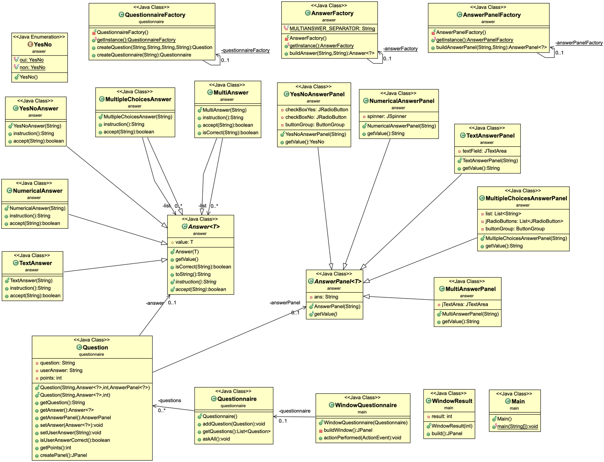

# Practical Work : Questionnaire
The "questionnaire" project is a list of questions that you must answer. There are several types of question, the multiple choices questions, the questions that have many answers, the questions whose answers are numeric, the questions whose answers are textual and the yes/no questions. Answer as many questions as you can to gain maximum points !
### Requirements
Requirement to compile the project :

- maven

### How to
To start the quizz, make sure that you have recovered the directory of the project with this command `git clone https://gitlab-etu.fil.univ-lille1.fr/landschoot/landschoot-congin-coo.git`
Go to the "questionnaire" repertory `cd landschoot-congin-coo/questionnaire` and do the command `mvn package`. The project is now installed, to launch the quizz in the UI interface and the terminal enter the command `java -jar target/questionnaire-1.0-SNAPSHOT.jar`.
To generate the javadoc, do the command `mvn javadoc:javadoc`and you will find it in the location ``target/docs``.

## Authors
* **Gabriel Congin** gabriel.congin.etu@univ-lille.fr 
* **Tony Landschoot** tony.landschoot.etu@univ-lille.fr

## Code
- Factory & singleton : AnswerPanelFactory allows you to easily create an instance of an AnswerPanel.
- Factory & singleton : AnswerFactory allows you to easily create an instance of an Answer.
- Factory & singleton : QuestionnaireFactory allows you to easily create an instance of an Question and Questionnaire.
- Composite : MultiAnswer & MultipleChoicesAnswer have a list of Answer, they redefine some methods of Answer (isCorrect (), accept ()) by calling this same method for each of the Answer's in the list

## Docs

